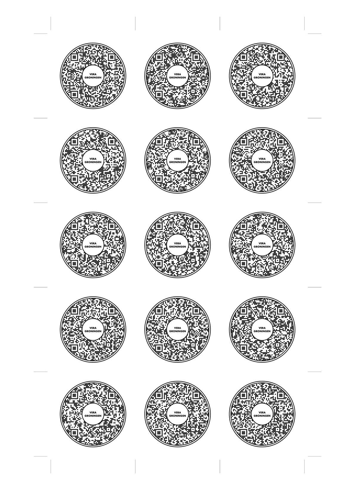
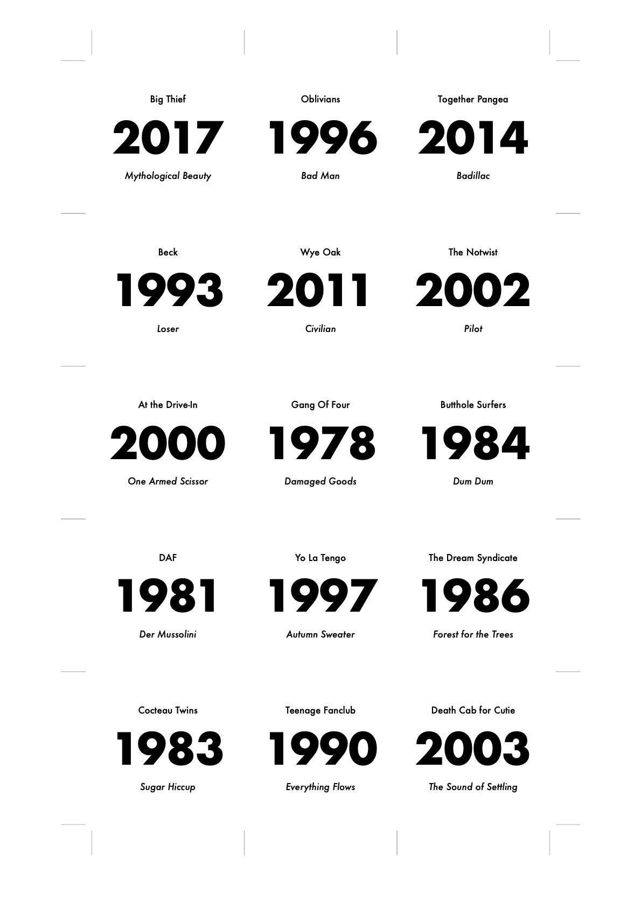

# Hitster Card Generator

This project generates printable [Hitster](https://hitstergame.com) cards from a Spotify playlist. It retrieves song
information from Spotify, generates QR codes linking to the songs, and creates a duplex printable PDF with cards using
[Typst](https://typst.app).

If you find this DIY Hitster project useful, consider giving it a star :) !

| Page Front | Page Back |
| ------------- | ------------- |
|  |   |

## ✨ Features

-   Spotify Integration: Fetches song details directly from a Spotify playlist.
-   QR Code Generation: Creates QR codes for each song, linking to its Spotify URL.
-   Printable Cards: Generates a PDF with formatted cards, ready for printing.
-   Configurable Layout: Allows customization of card size and page layout.
-   Flexible Filtering: Filter songs by date added, language, and more.

## ⚙️ Prerequisites

-   Python ^3.12 
-   Poetry (for dependency management)  
-   Spotify Developer Account (to obtain client credentials)

## 🛠️ Setup

1.  Clone the repository
2.  Install with pip or your favorite package manager:
    ```bash
    pip install .
    ```
3.  Set up Spotify API credentials:
    -   Create a Spotify Developer account and create an app to get your `CLIENT_ID` and `CLIENT_SECRET`.
    -   Create a `.env` file in the project root with the following content:
        ```env
        CLIENT_ID="your_client_id"
        CLIENT_SECRET="your_client_secret"
        PLAYLIST_ID="your_playlist_id"
        ```
    -   Alternatively, you can set these environment variables manually in your shell.
    -   The script will automatically load variables from `.env` using python-dotenv.

## ▶️ Usage

1.  Run the script:
    ```bash
    hitster-cards [playlist_id] [options]
    ```
2.  Print the `hitster-cards.pdf` file:
    -   Open the `hitster-cards.pdf` file and duplex print it.
    -   Cut along the provided markings to create the Hitster cards.

## Command-Line Arguments (main.py)

| Argument            | Type      | Default                | Description |
|---------------------|-----------|------------------------|-------------|
| playlist_id         | str       | $PLAYLIST_ID env var   | Spotify playlist ID (positional, optional; overrides env var) |
| --cards-pdf         | str       | hitster-cards.pdf      | Output PDF filename for cards |
| --overview-pdf      | str       | year-distribution.pdf  | Output PDF filename for year distribution bar chart |
| --month-lang        | de/en     | system locale          | Language for month names in release dates |
| --no-day            | flag      | False                  | Omit day from release date |
| --qr-type           | url/id    | url                    | QR code content: url (default) or id |
| --added-after       | str       | None                   | Only include songs added after this date (YYYY-MM-DD) |
| -v, --verbose       | flag      | False                  | Enable verbose output (show each song) |

## 🎲 How to Play

1.  Open your camera app and scan the QR code.
2.  Spotify will launch and the song will start playing.
3.  After scanning, quickly look away to keep things fair!
    - Since the song title and artist will be visible, the person scanning should not be the one guessing.
    - Since the release year might be visible on the cover, the person scanning should scan and look away.
4.  Have fun!

---

You can also use [openbeatster](https://github.com/schnitzelburger/openbeatster), a web application for scanning Spotify QR codes and playing tracks using the
Spotify Web Playback SDK. With openbeatster, you can host the server on any device in your local network (such as a
laptop or Raspberry Pi), control playback from your smartphone by scanning QR codes, and enjoy cross-device control from
any device on the same network. This makes playing with these music cards even easier and more interactive!

_Note: openbeatster is a companion project by a contributor to this repository._

## 🎨 Customization

-   Card Layout: Modify the `hitster.typ` file to customize the card layout, size, and appearance.
-   Spotify Playlist: Change the `PLAYLIST_ID` environment variable to use a different Spotify playlist.
-   Card Dimensions: Change the `card_size`, `rows`, and `cols` variables in `hitster.typ` to adjust the card dimensions and page layout.
-   Marking Size: Change the `marking_padding` to adjust the space for cutting.
